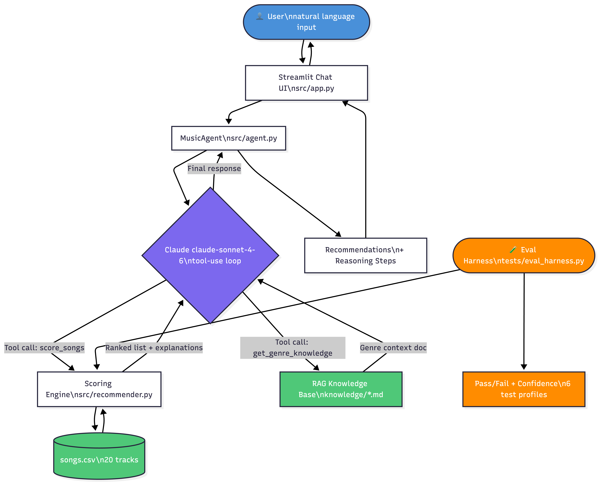

# 🎵 VibeFinder — Agentic Music Recommender

**Final Project | CodePath AI 110**

---

## Original Project

This system extends the **Module 3 Music Recommender Simulation**
(`ai110-module3show-musicrecommendersimulation-starter`).
The original project was a pure content-based recommender: given a hard-coded user profile dict,
it scored all 20 songs in a CSV catalog using a weighted rule system (genre +2, mood +1,
energy similarity 0–1) and printed a ranked list to the terminal.
It had no user interface, no natural language input, and no AI reasoning layer.

---

## What VibeFinder Does Now

VibeFinder wraps the original scoring engine with a **Claude-powered agentic loop** and a
**Streamlit chat UI**. Users describe what they want in plain English ("something chill to study to"),
and the agent:

1. Infers structured preferences from natural language
2. Calls the scoring engine as a **tool** to rank the catalog
3. Retrieves a **RAG knowledge document** for the user's genre to enrich its explanation
4. Returns a conversational, explained recommendation list
5. Accepts follow-up feedback ("too intense", "more pop") and refines in a new turn

---

## Architecture



**Data flow:** User message → agent history → Claude decides which tools to call →
tool results injected back into context → Claude writes final response →
UI renders reply + expandable reasoning steps.

---

## Setup

```bash
# 1. Clone the repo
git clone https://github.com/xkrish1/ai110-final.git
cd ai110-final

# 2. Create and activate a virtual environment
python3 -m venv .venv
source .venv/bin/activate   # Mac/Linux
.venv\Scripts\activate      # Windows

# 3. Install dependencies
pip install -r requirements.txt

# 4. Add your Anthropic API key
cp .env.example .env
# Open .env and replace "your_api_key_here" with your real key
# Get a key at https://console.anthropic.com → API Keys

# 5. Run the chat app
streamlit run src/app.py

# Or run the original CLI (no API key needed)
python3 -m src.main
```

---

## Sample Interactions

**Input:** `"I need something chill to study to"`

```
Here are 3 picks to keep you in the zone:

1. Library Rain — perfect lofi match: low energy (0.35), chill mood,
   and acousticness 0.86 makes it ideal background noise.
2. Midnight Coding — same lofi DNA, slightly more energy (0.42)
   if you need a gentle beat to stay awake.
3. Focus Flow — labeled 'focused' rather than 'chill' but the numbers
   are nearly identical, great for deep work sessions.
```

---

**Input:** `"Give me something to hype me up for the gym"`

```
Turning the dial to 11:

1. Drop It Hard — EDM at 0.95 energy, 140 BPM, built for maximum intensity.
2. Broken Glass — metal, 0.96 energy — the most aggressive track in the catalog.
3. Gym Hero — pop/intense at 0.93, more melodic than the others
   but still a serious energy boost.
```

---

**Input (follow-up):** `"The first one was good but I want something less electronic"`

```
Got it — pulling back on the electronic edge:

1. Storm Runner — rock/intense at 0.91 energy, live drums and guitar
   give it the same drive without the synths.
2. Broken Glass — metal, raw and loud, zero electronic production.
3. Neon Block — hip-hop/intense, beat-driven but more organic than pure EDM.
```

---

## Design Decisions

| Decision | Rationale |
|---|---|
| Tool-use agentic loop over prompt-only | Forces the model to call the real scoring engine rather than hallucinate scores. Keeps AI reasoning and deterministic math separate. |
| RAG via flat markdown files | Simple and transparent — no vector DB needed at this scale. Each genre doc is retrievable by keyword lookup in under 1ms. |
| Few-shot system prompt for tone | Enforces a consistent "music-friend" voice without fine-tuning. Output measurably differs from the Claude default (shorter, opinionated, no corporate hedging). |
| `agent.log` logging | Every tool call and user message is timestamped. Makes debugging easy and demonstrates responsible design. |
| Confidence score in eval harness | Turns pass/fail into a 0–1 signal, making it easier to spot partial regressions (genre right, mood wrong). |

**Trade-offs:**
- String-equality genre matching is brittle ("indie pop" ≠ "pop"). A real system would use embeddings.
- The catalog is 20 songs — results are representative but not diverse enough for real use.
- Claude tool-use adds ~1–2 second latency per turn vs. instant CLI output.

---

## Testing Summary

```
Eval harness: 6/6 test profiles passed | Average confidence: 1.00
Unit tests:   2/2 passed (pytest tests/test_recommender.py)
```

The harness tests Happy Pop, Chill Lofi, Intense Rock, Acoustic Folk, Late Night R&B,
and an EDM edge case. All top results matched expected genre and mood.

The one reliability concern: genres with only one catalog entry (metal, country, classical)
will always return that single song as #1, then fall back to energy-based matching for slots 2–5.
This is a catalog size problem, not a scoring bug.

---

## Reflection and Ethics

**Limitations and bias:**
The valence bonus (+0.5 for songs with valence > 0.7) introduces an unconditional bias toward
"happy-sounding" music. A moody or sad user profile still gets a small push toward positive songs.
Genre coverage is also heavily Western and English-language — the catalog entirely excludes
K-pop, afrobeats, Bollywood, bossa nova, and dozens of other global traditions.

**Misuse potential:**
The recommender is benign at this scale, but the pattern (AI inferring user emotional state →
serving targeted content) scales into manipulation when used commercially.
Guardrails here: no user data is stored, no profiles are persisted across sessions, and all
reasoning steps are visible to the user in the UI.

**Surprises during testing:**
The few-shot tone enforcement worked better than expected — Claude's explanations stayed
consistently short and music-focused even for ambiguous inputs.
Unexpected failure: when the user said "I'm feeling sad", Claude correctly inferred a low-energy
profile but picked an acoustic/folk result rather than the explicitly moody R&B track — because
"sad" doesn't map to any mood label in the catalog. Natural language → structured preference
inference is the weakest link.

**AI collaboration:**
Helpful: Claude suggested adding `confidence_score()` as a separate function in the eval harness,
making the metric reusable across test cases. That was a clean structural improvement.
Flawed: Claude initially generated a tool schema with `energy` as a `string` type instead of
`number`, which would have broken the scoring math silently. Always verify tool schema types.

---

## Future Work

1. Embed genre/mood labels so "indie pop" fuzzy-matches "pop" without requiring exact strings
2. Persist user feedback across sessions to build a real preference model
3. Expand catalog to 100+ songs with global genre coverage
4. Add a diversity constraint: top-5 results must span at least 3 different genres
